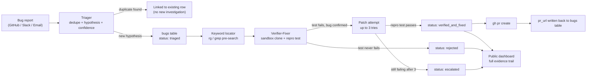
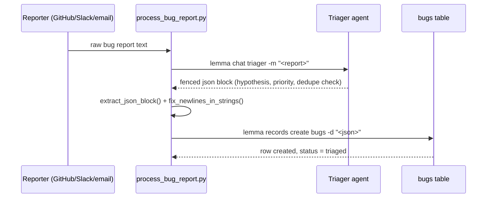
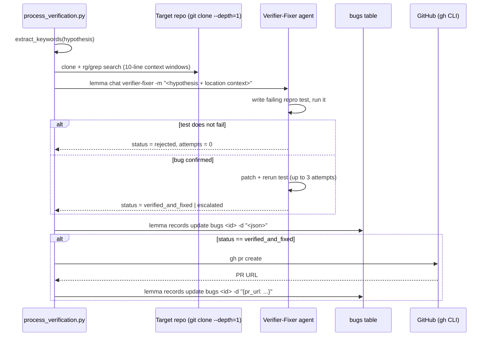
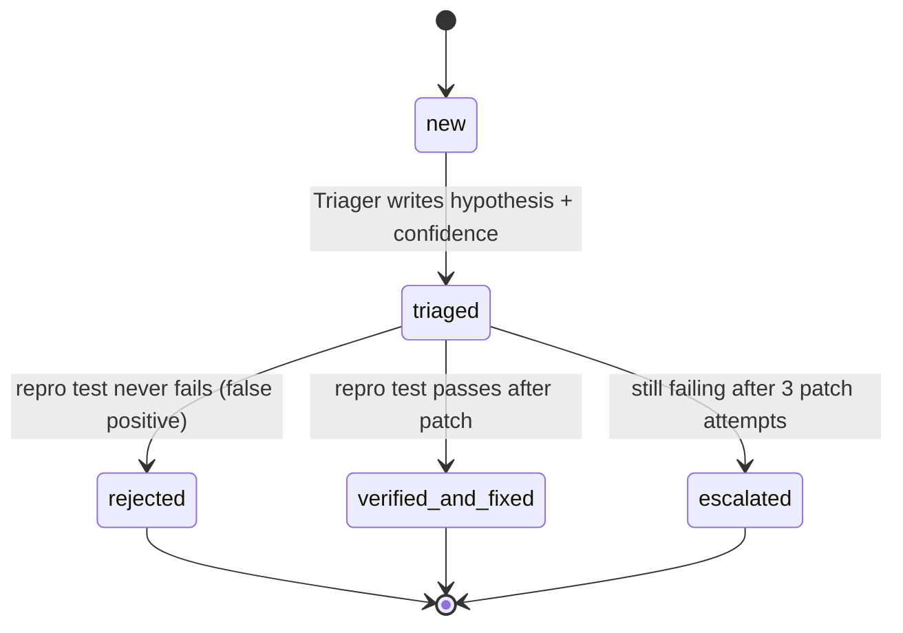

# janus-lite

Verification-first AI bug triage and auto-fix pipeline. Bug reports come in
from GitHub, Slack, or email; nothing gets marked fixed unless a real test
proves it. This directory is a **Lemma pod bundle** — plain files imported
with `lemma pods import` — plus a static dashboard site deployed as a
separate Lemma App.

## The problem

Two things are broken in most bug-handling setups today:

1. **Intake is fragmented.** Bugs show up as a GitHub issue, a Slack
   message, or a forwarded email, and each channel ends up triaged
   differently (or not at all) with no shared dedupe check.
2. **"AI fixed it" is usually a guess.** Most AI auto-fix tools generate a
   plausible-looking diff and report success based on the model's own
   confidence — there's no mechanical proof the bug ever existed or that
   the patch actually resolves it. That produces false confidence and
   pushes the real verification work back onto a human reviewer anyway.

JANUS-Lite exists to close both gaps: one intake contract across all three
channels, and a hard rule that a fix is never reported unless a test
actually failed before the patch and passed after it.

## How we stand out

- **Verification-first, fix-next** — the pipeline is structurally unable to
  report `verified_and_fixed` without a repro test that flipped from
  failing to passing. No test flip, no claim.
- **Honest escalation over fabrication** — after 3 patch attempts, the
  agent stops and escalates with a full evidence trail instead of looping
  forever or quietly declaring victory.
- **Pre-search grounding, not blind guessing** — before the fixer agent
  reasons about a fix, a deterministic keyword locator (`ripgrep`/`grep`/
  pure-Python fallback) has already found the real file:line hits, cutting
  down on hallucinated code references.
- **Structured-output contract** — both agents emit exactly one fenced JSON
  block and nothing else, so the orchestration layer never has to parse
  free-form prose.
- **Fully transparent, publicly auditable** — every hypothesis, repro test,
  patch diff, and evidence log is persisted and shown on the dashboard, not
  just a pass/fail badge.

## Tech stack

| Layer | What |
|---|---|
| Platform | [Lemma](https://lemma.work) pods — tables, agents, read-only SQL datastore, and Apps hosting |
| Agent runtime | `lemma chat <agent>` (CLI) driving the pod's configured LLM |
| Orchestration | Python 3.14 wrapper scripts (`process_bug_report.py`, `process_verification.py`) via `subprocess` |
| Code search | `ripgrep` (preferred) → `grep` → pure-Python `os.walk` fallback |
| Static analysis | `ruff` invoked ad hoc by the Verifier-Fixer agent itself over its own shell access (`bandit` is available to the agent the same way; not yet exercised in this demo's actual runs — see note below) |
| Version control / PRs | `git clone --depth=1` for sandboxed repro, GitHub CLI (`gh pr create`) for opening fixes |
| Data persistence | `lemma records create` / `lemma records update` against the `bugs` table |
| Dashboard | Static HTML/CSS/JS (no build step) — Playfair Display + Inter + JetBrains Mono, dark editorial design system |
| Dashboard data | `lemma --json query run "SELECT ..."` baked into `site/data/bugs.json` at deploy time (see [Dashboard](#dashboard-site) for why it's not live) |

> **On ruff/bandit honestly:** neither is hardcoded into the wrapper
> scripts as an enforced step. The Verifier-Fixer agent has general shell
> access (`WORKSPACE_CLI` toolset) and can choose to run static analysis
> tools as part of building its evidence — confirmed in real pipeline
> output, where one `verified_and_fixed` row's `static_analysis_findings`
> shows the agent actually ran `ruff v0.15.20` and reported findings
> repo-wide. `bandit` is equally available to it but hasn't shown up in a
> real evidence log yet. This is agent-driven diligence, not a guaranteed
> pipeline stage.

## Workflow

### Pipeline overview



### Triage (`process_bug_report.py`)



### Verify + fix (`process_verification.py`)



### Bug status lifecycle



## The agents

### Triager — `agents/triager`

First-line agent. Input: a raw bug report from any source. Output: exactly
one fenced JSON block, never a direct table write.

1. **Dedupe check** — if a read tool for the `bugs` table is available, it
   queries for existing rows with similar symptoms/component/error before
   creating a new investigation; a likely match gets recorded as
   `duplicate_of` instead of spawning a duplicate row.
2. **Hypothesis** — a concise, specific, and explicitly *untested* guess at
   the root cause, based only on the report text.
3. **Priority** — `critical`/`high`/`medium`/`low` from apparent severity
   and impact, deliberately not from the tone of the report.
4. **Source** — normalizes `github`/`slack`/`email` plus a `source_ref`.
5. **Status** — always emits `triaged`; it never marks anything
   `rejected` or `verified_and_fixed` itself.

### Verifier-Fixer — `agents/verifier-fixer`

Second-line, sandboxed agent. Input: a triaged row (hypothesis, priority,
repo URL). Output: exactly one fenced JSON block. This is where the
verification-first contract actually lives:

1. **Clone** the target repo into a sandbox workspace.
2. **Write a failing repro test** based on the hypothesis and run it
   scoped to just that test.
   - Doesn't fail (or fails for an unrelated reason) → `status: rejected`,
     `attempts: 0`, and an `evidence_log` explaining why it didn't
     reproduce. Stop here — no patch is attempted on an unconfirmed bug.
3. **Patch** — only once the test has failed for the right reason is a
   targeted patch attempted.
4. **Re-run the repro test** after each patch:
   - Passes → `status: verified_and_fixed`.
   - Fails → revert, feed the failure output into the next attempt, up to
     **3 total attempts**.
   - Still failing after 3 → `status: escalated`, with a detailed
     `evidence_log` of what was tried and why it's harder than expected.
5. **Always records**: `attempts`, the full `repro_test` source,
   `patch_diff` in unified diff format (even failed attempts), and an
   `evidence_log` of what ran and what it concluded.

The agent's sandbox runs Python 3.14, which can't install `crewai`/`numpy`/
most ML packages — so its default test strategy is stdlib `ast` inspection
rather than executing the target project's own (often heavy) dependencies.
That's a real environment constraint documented in its instructions, not a
design ideal — package installs are a one-shot, non-retried fallback only.

## The python wrappers

Two orchestration scripts glue the CLI-driven agents to the `bugs` table —
neither one is itself an AI agent; they're plumbing:

- **`process_bug_report.py`** — `lemma chat triager -m "<report>"` →
  extracts the trailing fenced JSON block from the CLI's terminal output
  (which word-wraps long strings, so a small state-machine parser strips
  bare newlines that fall inside JSON string values before `json.loads`)
  → `lemma records create bugs -d '<json>'`.
- **`process_verification.py`** — does everything above plus the keyword
  locator (regex-based identifier extraction from the hypothesis text,
  then `rg`/`grep`/pure-Python search with 10-line context windows) run
  *before* the agent is invoked, so the Verifier-Fixer starts with real
  file:line hits instead of guessing where to look. After a
  `verified_and_fixed` result, it also runs `gh pr create` and writes the
  resulting `pr_url` back to the row.
- **`scripts/fetch_bugs.py`** / **`scripts/generate_static_data.py`** —
  same idea, simpler: pull the current `bugs` table via
  `lemma --json query run` and bake it into `site/data/bugs.json` for the
  public dashboard (see below).

## Layout

```
janus-lite/
  pod.json
  tables/bugs/bugs.json          # bug records: status, hypothesis, repro_test,
                                  # patch_diff, evidence_log, pr_url, etc.
  agents/triager/                # first-line triage agent
  agents/verifier-fixer/         # sandboxed repro + patch + verify agent
  scripts/
    fetch_bugs.py                # pulls the bugs table via `lemma query run`
    generate_static_data.py      # wrapper: regenerates site/data/bugs.json
  site/                          # dashboard, deployed as its own Lemma App
    index.html                   # landing page
    dashboard.html               # live-ish bugs table + metrics
    pipeline.html                # agent architecture + verification contract
    data/bugs.json               # static snapshot the dashboard fetches

process_bug_report.py            # repo root: triage orchestrator (see above)
process_verification.py          # repo root: verify+fix orchestrator (see above)
```

## The `bugs` table

Key columns: `source` (github/slack/email), `priority` (critical/high/
medium/low), `status` (new/triaged/reproducing/rejected/verified_and_fixed/
escalated), `confidence` (high/medium/low), `hypothesis`, `repro_test`,
`patch_diff`, `evidence_log`, `attempts`, `pr_url`, `static_analysis_findings`.
Full schema in `tables/bugs/bugs.json`.

## Dashboard (`site/`)

Three pages sharing one dark, editorial design system (`site/css/style.css`):
landing/hero, a live dashboard (metrics, filterable bugs table with
expandable detail rows), and a pipeline/architecture page.

The dashboard is deployed as a **public** Lemma App
(`janus-dashboard`), but there's no anonymous read path for pod data —
`client.datastore.query()` requires an authenticated session even for
public apps. So the dashboard doesn't query live: it fetches a static
`site/data/bugs.json` snapshot baked into the app bundle at deploy time.

**To refresh the dashboard with current data:**

```bash
python janus-lite/scripts/generate_static_data.py
lemma apps deploy janus-dashboard janus-lite/site -y
```

The data only updates on redeploy, not live — acceptable for a demo, but
worth remembering if the `bugs` table has moved on since the last deploy.
The dashboard's "Data generated ..." timestamp always shows how stale the
current snapshot is.

## The verification contract

> No fix ships without mechanical proof. If JANUS-Lite cannot produce a
> failing test that passes after the patch, it does not open a PR — it
> escalates honestly with the full evidence trail.

Every row in the dashboard's expandable detail panel exists to make that
contract checkable by a human: the exact hypothesis, the exact repro test,
the exact patch diff, and the exact evidence log that led to the final
status. Nothing is summarized away.

## Build loop
```bash
lemma pods import ./janus-lite --dry-run   # validate
lemma pods import ./janus-lite             # upsert by resource name
```

## Non-bundled setup (do these after import)
- Upload any required files: `lemma files upload ./doc.pdf /pod/knowledge/doc.pdf`
- Connect connectors/accounts: `lemma connectors ...`
- Flip schedules/surfaces to active once their targets exist.

## Verify
```bash
lemma pods describe
lemma agents chat hello "what can you do in this pod?"
curl -s https://janus-dashboard.apps.lemma.work/data/bugs.json   # dashboard data is fresh + public
```
